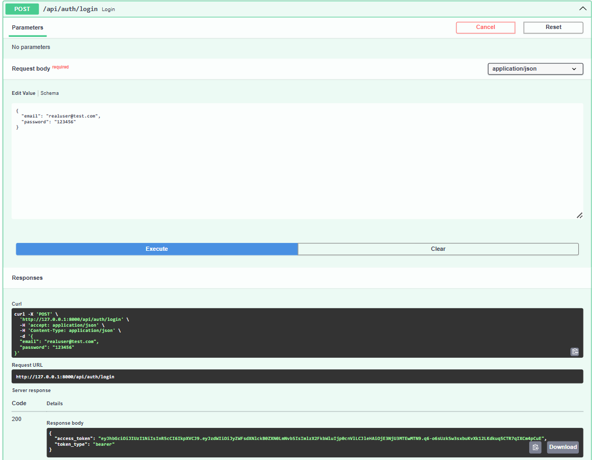
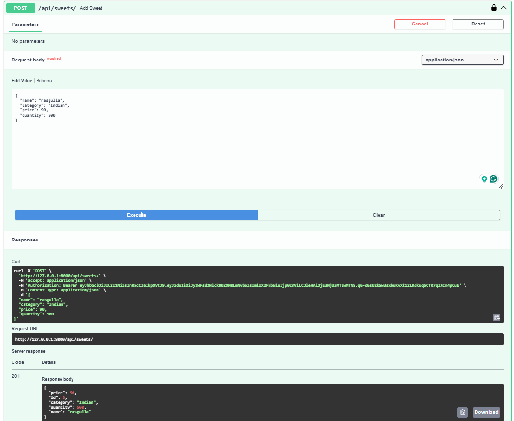
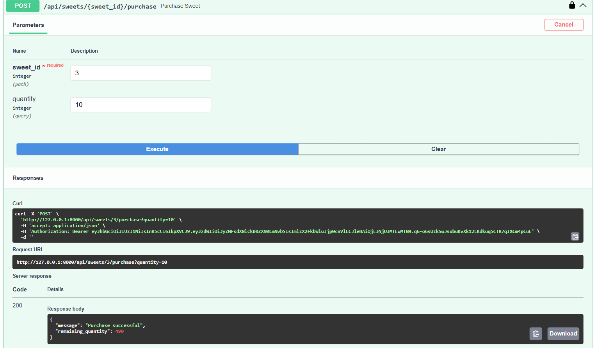

# 🍬 Sweet Shop Management API

A backend REST API built using **FastAPI** for managing a sweet shop.
The system supports authentication, role-based access (Admin/User),
inventory management, purchasing, restocking, and searching sweets.

---

## 🚀 Live Deployment

🔗 **Backend API (Render):**  
https://sweet-shop-management-ssrh.onrender.com

📘 **Swagger API Docs:**  
https://sweet-shop-management-ssrh.onrender.com/docs

---


## 🚀 Features

### 🔐 Authentication

* User Registration
* User Login (JWT Authentication)
* Role-based access (Admin / User)

### 🍭 Sweet Management

* Add sweets (Admin only)
* Update sweets (Admin only)
* Delete sweets (Admin only)
* View all sweets (Authenticated users)

### 🛒 Purchase & Inventory

* Purchase sweets (Logged-in users)
* Automatic stock reduction
* Restock sweets (Admin only)

### 🔍 Search

* Search sweets by:

  * Name
  * Category
  * Min price
  * Max price

---

## 🧑‍💻 Tech Stack

* **Backend**: FastAPI
* **Database**: SQLite
* **ORM**: SQLAlchemy
* **Auth**: JWT (Bearer Token)
* **Docs**: Swagger UI

---

## 📂 Project Structure

```
backend/
│
├── app/
│   ├── core/
│   ├── models/
│   ├── routes/
│   ├── schemas/
│   └── main.py
│
├── screenshots/
├── requirements.txt
└── README.md
```

---

## ▶️ How to Run

### 1️⃣ Create virtual environment

```bash
python -m venv venv
venv\Scripts\activate
```

### 2️⃣ Install dependencies

```bash
pip install -r requirements.txt
```

### 3️⃣ Run server

```bash
uvicorn app.main:app --reload
```

### 4️⃣ Open Swagger UI

```
http://127.0.0.1:8000/docs
```

---

## 📸 API Screenshots

> Screenshots are stored inside the `screenshots/` folder

### Swagger Home


### User Login



### Add Sweet (Admin Only)



### Purchase Sweet



### Search Sweets


---

## 🔑 Roles & Access

| Action       | User | Admin |
| ------------ | ---- | ----- |
| View sweets  | ✅    | ✅     |
| Purchase     | ✅    | ✅     |
| Add sweet    | ❌    | ✅     |
| Update sweet | ❌    | ✅     |
| Delete sweet | ❌    | ✅     |
| Restock      | ❌    | ✅     |

---

## ✅ Status

✔ Authentication working
✔ Admin authorization enforced
✔ Inventory updates correctly
✔ Search functionality working

---

## 📌 Note

Frontend is **not mandatory** for this project.
Swagger UI is used for demonstration and testing.

---

## 👨‍💻 Author

**Pratham**
